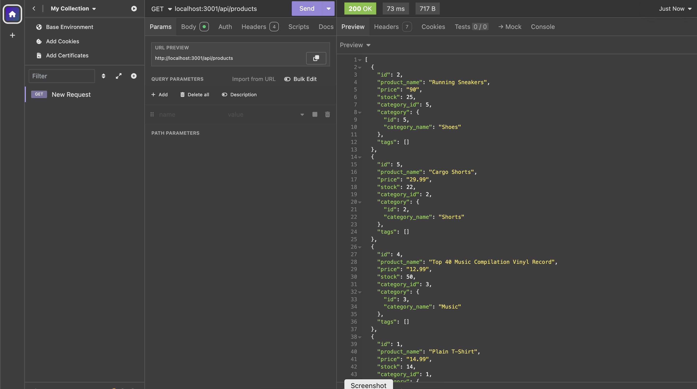
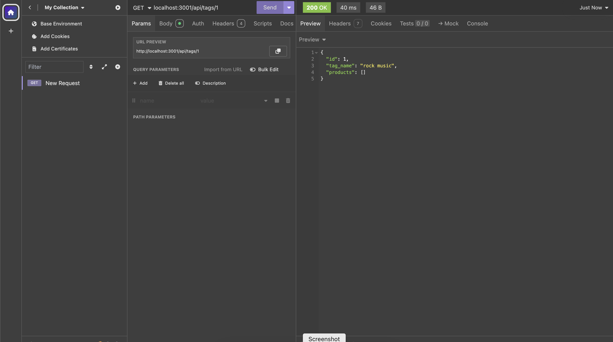

# Thirteen-E-commerce
A back end for An e-commerce site. Working with Express.js API  using Sequelize to interact with a PostgreSQL database.
## Connection
Connecting to database 
Click the link to watch the demo ---->>> [linkconnection](https://youtu.be/g6Zxli9OVW8) 
 

## Demo
>>>> Using Demo <<<< 

Click the link to watch the demo ---->>> [linkget](https://youtu.be/IycoxutU1kY) 
The usage for this is to return all categories,products,tags  

When you input GET in insomia with localhost:3001/api/categories 
 
When you input GET in insomia with localhost:3001/api/tags 

When you input GET in insomia with localhost:3001/api/products 

Click the link to watch the demo ---->>> [linkgetid](https://youtu.be/-OI0w62UrEg)   
Using the route to return a single category ,product and tag  

When you input localhost:3001/api/categories/1 
 
When you input localhost:3001/api/tags/1 
 
When you input localhost:3001/api/products/1 
 

Click the link to watch the demo ---->>> [linkpost](https://youtu.be/J6a2anTvLAU)  
Using POST PUT DELETE routes for categories are being tested  

When you input POST localhost:3001/api/categories 
 
When you input PUT localhost:3001/api/categories 
 
When you input DELETE localhost:3001/api/categories 
 
