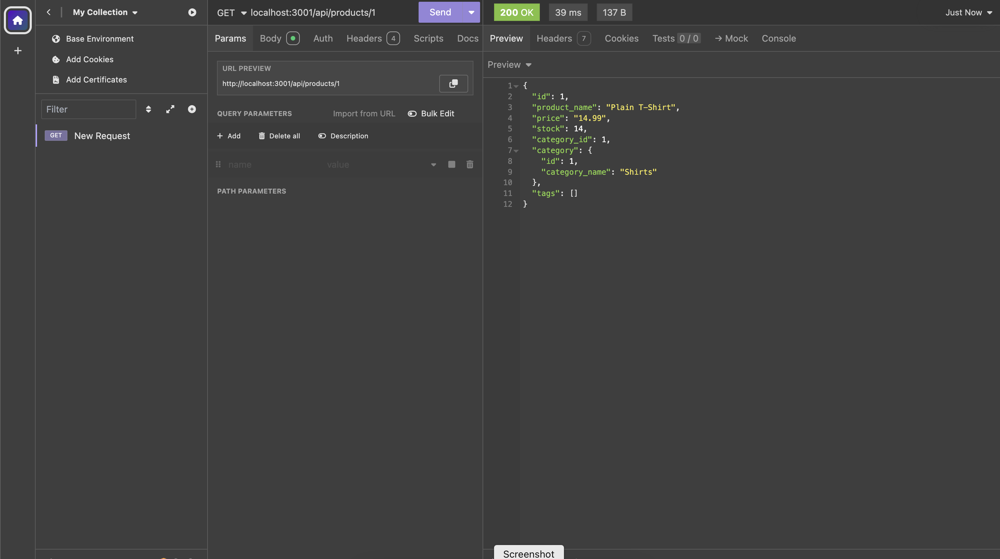

# Thirteen-E-commerce
A back end for An e-commerce site. Working with Express.js API  using Sequelize to interact with a PostgreSQL database.
## Demo
>>>> Using Demo <<<< 
When you input GET in insomia with localhost:3001/api/categories 

When you input GET in insomia with localhost:3001/api/tags 

When you input GET in insomia with localhost:3001/api/products 

When you input localhost:3001/api/categories/1 
 
When you input localhost:3001/api/tags/1 
 
When you input localhost:3001/api/products/1 
 

When you input POST localhost:3001/api/categories 
 
When you input PUT localhost:3001/api/categories 
 
When you input DELETE localhost:3001/api/categories 
 